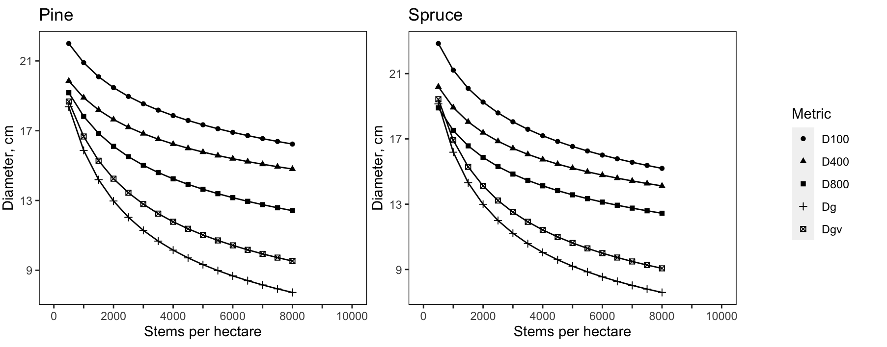

```{r setup, include=FALSE}
knitr::opts_chunk$set(echo = TRUE)
library(tidyverse)
library(forester)
library(cowplot)
```

This markdown demonstrates usage of functions from @pettersson1992 by recreating the plot on page 11, part 2. This regards *experimental plots*.

```{r eval=FALSE, echo=TRUE}

diameters <- function(species,low,high,Hdom,SI){
  
  if(species=="Pinus sylvestris"){
  #empty table
  diameter_table <-data.frame(matrix(nrow=0,ncol = 6,dimnames = list(NULL,c("stems","Dg","Dgv","D800","D400","D100"))))
  diameter_table_1 <- data.frame(matrix(nrow=0,ncol = 6,dimnames = list(NULL,c("stems","Dg","Dgv","D800","D400","D100"))))
  
  
  for(i in 1:length(seq(low,high,by=500))){
    
    stems <- seq(low,high,by=500)[i]
    
    form_quotient_Pine <- Pettersson_1992_form_quotient_after_PCT_Spruce(dominant_height = Hdom ,stems = stems )
    volume_Pine <- Pettersson_1992_total_volume_yield_after_PCT_Pine(stems = stems ,dominant_height = Hdom ,SI = SI)
    
    mean_basal_area_stem_BA <- (volume_Pine/form_quotient_Pine)/stems
    mean_basal_area_stem_cm <- 2*sqrt(mean_basal_area_stem_BA/pi)*100
    
    Dgv <- Pettersson_1992_BA_weighted_mean_diameter_after_PCT_Pine(dominant_height =Hdom ,diameter_mean_basal_area_stem = mean_basal_area_stem_cm)
    
    D800<- Pettersson_1992_mean_diameter_x_trees_after_PCT_Pine(dominant_height = Hdom,diameter_mean_basal_area_stem = mean_basal_area_stem_cm,thickest_x_trees = 800)
    D400<- Pettersson_1992_mean_diameter_x_trees_after_PCT_Pine(dominant_height = Hdom,diameter_mean_basal_area_stem = mean_basal_area_stem_cm,thickest_x_trees = 400)
    D100<- Pettersson_1992_mean_diameter_x_trees_after_PCT_Pine(dominant_height = Hdom,diameter_mean_basal_area_stem = mean_basal_area_stem_cm,thickest_x_trees = 100)
    
    diameter_table_1[1,"stems"] <- stems
    diameter_table_1[1,"Dg"] <- mean_basal_area_stem_cm
    diameter_table_1[1,"Dgv"] <- Dgv
    diameter_table_1[1,"D800"] <- D800
    diameter_table_1[1,"D400"]<- D400
    diameter_table_1[1,"D100"] <- D100
    
    diameter_table <- dplyr::bind_rows(diameter_table,diameter_table_1)

  }
  
  return(diameter_table)
  }
  
  if(species=="Picea abies"){
    #empty table
    diameter_table <-data.frame(matrix(nrow=0,ncol = 6,dimnames = list(NULL,c("stems","Dg","Dgv","D800","D400","D100"))))
    diameter_table_1 <- data.frame(matrix(nrow=0,ncol = 6,dimnames = list(NULL,c("stems","Dg","Dgv","D800","D400","D100"))))
    
    
    for(i in 1:length(seq(low,high,by=500))){
      
      stems <- seq(low,high,by=500)[i]
      
      form_quotient_Spruce <- Pettersson_1992_form_quotient_after_PCT_Spruce(dominant_height = Hdom ,stems = stems )
      volume_Spruce <- Pettersson_1992_total_volume_yield_after_PCT_Spruce(stems = stems ,dominant_height = Hdom ,SI = SI)
      
      mean_basal_area_stem_BA <- (volume_Spruce/form_quotient_Spruce)/stems
      mean_basal_area_stem_cm <- 2*sqrt(mean_basal_area_stem_BA/pi)*100
      
      Dgv <- Pettersson_1992_BA_weighted_mean_diameter_after_PCT_Spruce(dominant_height =Hdom ,diameter_mean_basal_area_stem = mean_basal_area_stem_cm)
      
      D800<- Pettersson_1992_mean_diameter_x_trees_after_PCT_Spruce(dominant_height = Hdom,diameter_mean_basal_area_stem = mean_basal_area_stem_cm,thickest_x_trees = 800)
      D400<- Pettersson_1992_mean_diameter_x_trees_after_PCT_Spruce(dominant_height = Hdom,diameter_mean_basal_area_stem = mean_basal_area_stem_cm,thickest_x_trees = 400)
      D100<- Pettersson_1992_mean_diameter_x_trees_after_PCT_Spruce(dominant_height = Hdom,diameter_mean_basal_area_stem = mean_basal_area_stem_cm,thickest_x_trees = 100)
      
      diameter_table_1[1,"stems"] <- stems
      diameter_table_1[1,"Dg"] <- mean_basal_area_stem_cm
      diameter_table_1[1,"Dgv"] <- Dgv
      diameter_table_1[1,"D800"] <- D800
      diameter_table_1[1,"D400"]<- D400
      diameter_table_1[1,"D100"] <- D100
      
      diameter_table <- dplyr::bind_rows(diameter_table,diameter_table_1)
      
    }
    
    return(diameter_table)
    
  }
}

results_pine <- diameters(low = 500,high = 8000,Hdom = 14,SI = 20,species="Pinus sylvestris")
results_pine <- results_pine %>% pivot_longer(-stems,names_to="Metric",values_to="Diameter")

results_spruce <- diameters(low = 500,high = 8000,Hdom = 14,SI = 20,species="Picea abies")
results_spruce <- results_spruce %>% pivot_longer(-stems,names_to="Metric",values_to="Diameter")


a <- ggplot()+
  geom_point(data=results_pine,aes(x=stems,y=Diameter,shape=Metric))+
  geom_line(data=results_pine,aes(x=stems,y=Diameter,group=Metric))+
  scale_y_continuous(breaks=seq(1,25,4))+
  scale_x_continuous(limits=c(0,10000),n.breaks = 12,labels = c("0","","2000","","4000","","6000","","8000","","10000"))+
  theme(panel.background = element_blank(),
        panel.border = element_rect(fill=NA),
        legend.position = "none",
        plot.margin = margin(6, 2, 6, 2))+
  labs(title="Pine",x = "Stems per hectare",y="Diameter, cm")

b <- ggplot()+
  geom_point(data=results_spruce,aes(x=stems,y=Diameter,shape=Metric))+
  geom_line(data=results_spruce,aes(x=stems,y=Diameter,group=Metric))+
  scale_y_continuous(breaks=seq(1,25,4))+
  scale_x_continuous(limits=c(0,10000),n.breaks = 12,labels = c("0","","2000","","4000","","6000","","8000","","10000"))+
  theme(panel.background = element_blank(),
        panel.border = element_rect(fill=NA),
        plot.margin = margin(6, 2, 6, 2))+
  labs(title = "Spruce",x = "Stems per hectare",y="Diameter, cm")

legend <- get_legend(b + theme(legend.box.margin = margin(0, 0, 0, 12)))

b <- b+theme(legend.position="none")


c <- cowplot::plot_grid(a,b)

d <- cowplot::plot_grid(c,legend,rel_widths = c(2,.4))

```

```{r echo=FALSE}



```
